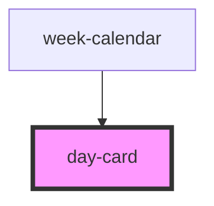

# day-card

<!-- Auto Generated Below -->

## Properties

| Property   | Attribute  | Description | Type      | Default     |
| ---------- | ---------- | ----------- | --------- | ----------- |
| `day`      | --         |             | `Date`    | `undefined` |
| `disable`  | `disable`  |             | `boolean` | `false`     |
| `locale`   | `locale`   |             | `string`  | `undefined` |
| `selected` | `selected` |             | `boolean` | `false`     |

## Dependencies

### Used by

 - [week-calendar](../week-calendar)

### Graph

----------------------------------------------

*Built with [StencilJS](https://stenciljs.com/)*
