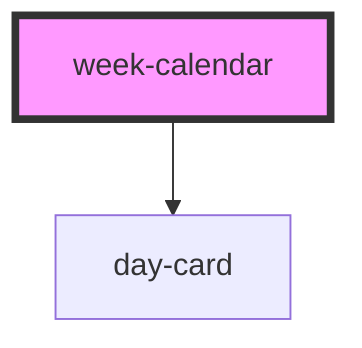

# week-calendar

<!-- Auto Generated Below -->

## Properties

| Property          | Attribute          | Description | Type      | Default      |
| ----------------- | ------------------ | ----------- | --------- | ------------ |
| `blockBefore`     | `block-before`     |             | `boolean` | `true`       |
| `disableDates`    | `disable-dates`    |             | `string`  | `undefined`  |
| `disableWeekends` | `disable-weekends` |             | `boolean` | `false`      |
| `enableDates`     | `enable-dates`     |             | `string`  | `undefined`  |
| `locale`          | `locale`           |             | `string`  | `'en-US'`    |
| `selectedDay`     | `selected-day`     |             | `any`     | `new Date()` |
| `startDate`       | `start-date`       |             | `any`     | `new Date()` |
| `startDay`        | `start-day`        |             | `number`  | `1`          |

## Events

| Event          | Description | Type               |
| -------------- | ----------- | ------------------ |
| `valueUpdated` |             | `CustomEvent<any>` |

## Dependencies

### Depends on

- [day-card](../day-card)

### Graph

----------------------------------------------

*Built with [StencilJS](https://stenciljs.com/)*
